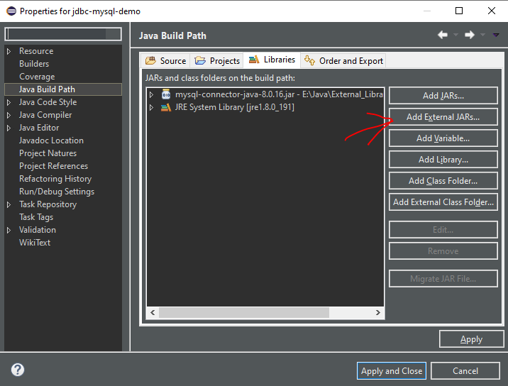

**JDBC MySQL Connection Demo**

1. Download JDBC mysql connector. 
link: <a href="https://dev.mysql.com/downloads/connector/j/">Download JDBC</a>

2. Add JDBC into your project(e.g. Eclipse). 

3. Write the code and go...
